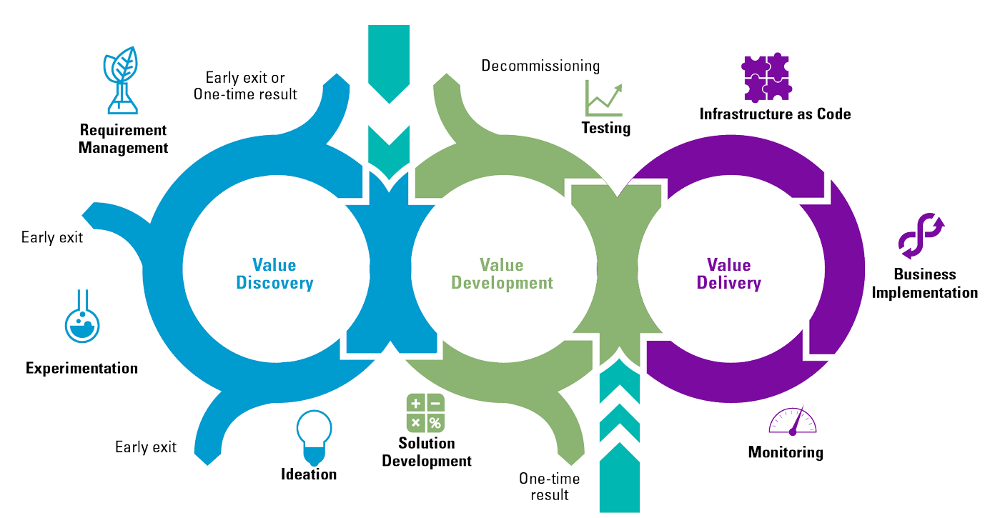

# Principles of Modern Software Management

The principles of modern software management have come about because software projects have become more complicated over time. Traditional ways of managing these projects just aren't enough anymore. So, these principles are like a guidebook for making the software development process better. They help teams work more efficiently and make sure they deliver software that works well and is trustworthy.

1. **Architecture-First Approach**:

   - Build a strong architecture for your software from the start. Identify and address issues early on to enhance productivity.

2. **Iterative Life Cycle Process**:

   - Repeat steps like requirement gathering, design, implementation, and testing to reduce risks and improve the quality of the software.

3. **Component-Based Approach**:

   - Reuse previously defined functions and code components to speed up development and increase efficiency.

4. **Change Management System**:

   - Manage changes carefully to improve software quality. Implement and test changes to ensure they meet standards.

5. **Round Trip Engineering**:

   - Simultaneously generate and analyze code to facilitate developers' work in a dynamic environment.

6. **Model-Based Evolution**:

   - Use a model-based approach to support the evolution of graphical and textual elements in the software.

7. **Objective Quality Control**:

   - Focus on improving software quality through clear quality management plans, metrics, checklists, and improvement measures.

8. **Evolving Levels of Details**:

   - Plan software releases with increasing levels of detail in terms of usage scenarios, architecture, and other details.

9. **Establish a Configurable Process**:

   - Use a flexible process that can be adjusted based on project needs to ensure scalability and efficiency.

10. **Demonstration-Based Approach**:
    - Use demonstrations to effectively communicate about the problem, approach, and solution, thereby improving productivity and software quality.

    
