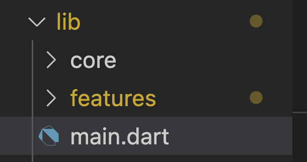
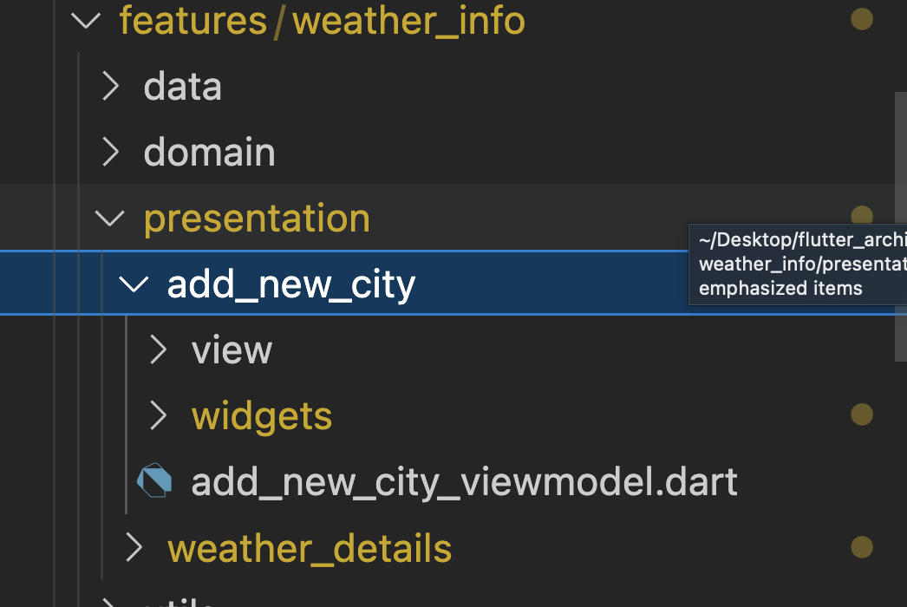
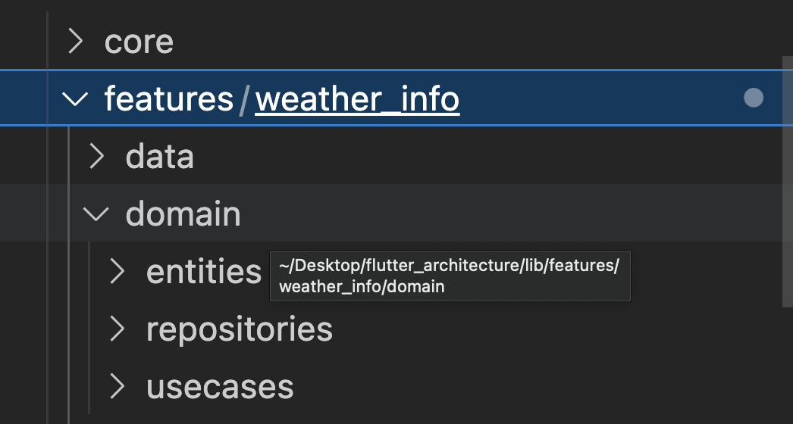
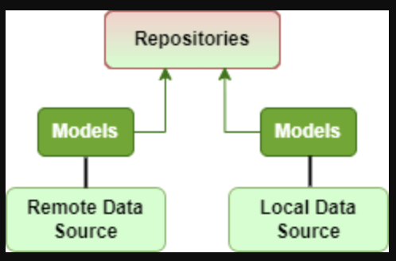
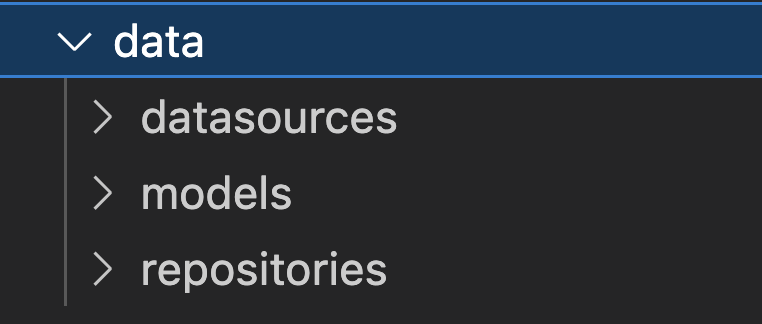

# Flutter Clean Architecture

`This post is the first part of a tutorial series for Clean Architecture!.`

In their early stages, some software developers only struggle to pick up new skills quickly and create functional features; they don't worry about writing clean code or following the right architecture to improve application performance. When using a framework, some other developers often use the well-known MVC pattern, which enables us to separate our application into models, views, and controllers. This is not a problem when developing simple apps, but when we need to scale an application by adding new features, updating a library, or doing something similar, we encounter a number of problems because, as our code becomes more coupled, it becomes more challenging to make changes in our application without also making numerous changes throughout our code. As a result, before you begin developing your application, you must first design the appropriate architecture.

## [1]: An Overview

When designing your application architecture, it is essential that you respond to several principles, including:

- [SOLID]('https://medium.com/@sanjayofficial94/s-o-l-i-d-principals-41a5b3b604eb'): five object-oriented programming principles contribute to the readability, adaptability, and maintainability of OOP designs.

- [KISS]('https://www.baeldung.com/cs/kiss-software-design-principle'): a design principle stating that designs and/or systems should be as simple as possible in order to maximize user acceptance and interaction.

- [DRY]('https://www.baeldung.com/cs/dry-software-design-principle'): a software development principle which stands for 'don't repeat yourself,' that aims to reduce code duplication in favor of abstractions and avoiding redundancy.

# [2]:Architectures that implement the preceding principles

- Hexagonal Architecture: the Ports and Adapters architecture is based on the idea of separating the application into loosely coupled components in order to isolate the core business logic from outside concerns.

- Onion Architecture: this architecture is made up of multiple concentric layers that connect to the core, which represents the domain. In fact, this architecture is based on the principle of control inversion.

- The Clean architecture: Uncle Bob's architecture is based on the dependency inversion principle to define boundaries between high-level and low-level components. Furthermore, this architecture attempts to combine all previous architectures into a single actionable idea.

So, as we can see, the fundamental objective of all these architectures is to achieve a clear separation of concerns. This is accomplished by dividing the software into distinct layers, typically including a layer for business rules and another for interfaces. Furthermore, each architecture establishes a well-defined system that is:

1. [Independent of Frameworks]()
2. [Testable]()
3. [Independent of UI]()
4. [Independent of Database]()
5. [Independent of any external agency]()

After discussing the most popular architectures and their roles, we'll build an architecture for every Flutter application based on C. Martin's (also known as Uncle Bob's) concept, which contains several architecture ideas.

It should be noted that this architecture is not simply a folder structure that you can copy and paste into your project. It is the concept of separating your application into layers while adhering to Uncle Bob's Dependency Rule, which states that:

`Nothing in an inner circle can know anything at all about something in an outer circle.`

In other words, no variable, class or function declared in an outer circle can be mentioned in an inner circle.

Let's start by integrating this architecture into a Flutter project.

We will create a weather application which aims to visualize the weather of a specific city.

- This application has two interfaces: one for displaying the details of the city's weather.

  

- Another for adding a new city. This app will include the most basic functionalities, such as getting data from an API, storing data in a local database, handling errors,and so on.

## Flutter Clean Architecture and data flow

We'll use the Provider technique for state management in this project, as seen in the figure above. However, as clean architecture is not connected to any particular state management methodology, you are free to choose an alternative strategy that fits with your preferences and project objectives.

The above image also represents the data flow of each user-triggered event. In fact, when a user interacts with the Widget, we communicate their action to the Provider class, which then connects to the useCase to retrieve the action's result. Following that, the useCase communicates with the Repository class in order to obtain the solution from a remote or local DataSource.

So, to begin implementing these layers, let's divide our project into subfolders.

We create two subfolders in the lib folder.

- The first is called “core”, and it contains all of the shared and basic components, as well as the implementation of core features such as dependency injection.
- The second folder is titled "features," and it contains every "feature" of the app. For example, in our case, we only have one feature that represents weather information, and it contains two interfaces: one for details and another for adding new cities. Each feature will also be separated into three layers: data, domain, presentation, and utils.
- The utils folder is not necessary for every feature; it is only required when you have individual feature utilities such as enums, classes, extension functions, and so on.

## Explanation of feature layers

### Presentation

This layer, as its name implies, is in charge of presenting data to the user via widgets. This layer is also responsible for listening for states and connecting to the Provider class, which will delegate all work to the specific use case. In most cases, the presentation layer's primary task is to handle basic input validations, animations, and user interactions.

### Applied to the Weather App

Every interface in our case will have two subfolders, one for the view file and the other for its widgets. We also include the provider file.

### Domain

This is the glue layer that connects the other two layers. It will use business objects (entities) and use cases to implement our application's business logic. In addition, every use case relies on the Repository to retrieve data.

**Entity**: Encapsulates enterprise-wide high-level business rules. Only fields relevant from a "business standpoint" are held by an entity. It represents the final result utilized by the view and is least likely to change with external alterations. Additionally, the entity doesn't necessarily need to possess the same fields returned by the web service. You can customize its fields based on interface requirements. For instance, if the call model returns a timestamp date format, your entity can contain the converted date that will be parsed.

**Use Case**: Orchestrates the flow of data to and from the entity. A use case, in its simplest form, represents a user action such as retrieving weather data by city, coordinates, etc. To comply with the Single Responsibility SOLID principle, each use case should be independent of others.

The domain layer should be completely independent of all other layers. But how can it be independent when any use case obtains data from a Repository shared with the data layer? This is where the art of dependency inversion comes in, one of the SOLID principles. In the domain layer, we create an abstract Repository class to define a contract for what the Repository must do. In the data layer, we implement this contract.

**Repository**: Serves as a single source of truth, separating the logic that retrieves data and maps it to the entity model. This class collects data from various sources (REST APIs, local databases, cache, etc.) and provides it to the rest of the app. Other components don't need to know where the data comes from; they simply consume it.

### Applied to the Weather App

In our case, the domain layer will be divided into three distinct layers: entities, repository contracts, and use cases.

### Data

This layer is responsible for data retrieval from multiple sources. It consists of a repository class that implements the domain contract and determines whether to return fresh or cached data and when to cache it. Additionally, the data source class handles fetching data from a specific source, typically a remote API or local database.

### Applied to the Weather App

Three layers will make up our data layer: datasources, implementations of repositories, and models. Due to the fact that every data source delivers it, we have the models folder rather than entities. In fact, each model is responsible for converting unstructured data (JSON, etc.) into Dart objects by using certain methods (fromJSON, toJSON, etc.).

